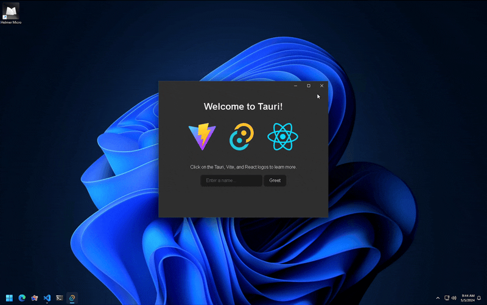

# tauri-plugin-decorum

Being a designer, I'm _very_ particular about window decorations. This Tauri (v2) plugin is an opinionated take on titlebars that my gripes with the default ones. Features:
1. retain native features, like Windows Snap Layout.
2. blend into your app's UI better with transparency and overlay controls.
3. inset macOS traffic lights that are often misaligned with other window contents.



## Installation and Usage

For a full example app that uses this plugin, check out [examples/tauri-app](examples/tauri-app/).

### install the plugin

```bash
cargo add tauri-plugin-decorum
```

### set permissions

You'll need to set these for your window in `src-tauri/capabilities/default.json`

```
"core:window:allow-close",
"core:window:allow-center",
"core:window:allow-minimize",
"core:window:allow-maximize",
"core:window:allow-set-size",
"core:window:allow-set-focus",
"core:window:allow-is-maximized",
"core:window:allow-start-dragging",
"core:window:allow-toggle-maximize",
"decorum:allow-show-snap-overlay",
```

And ensure the `withGlobalTauri` in your `tauri.conf.json` is set to `true`.

\*there's probably a better way to handle plugin permissions that I haven't found yet. if you have, pls lmk!


### usage in tauri:

```rust
use tauri::Manager;

use tauri_plugin_decorum::WebviewWindowExt; // adds helper methods to WebviewWindow

fn main() {
	tauri::Builder::default()
		.plugin(tauri_plugin_decorum::init()) // initialize the decorum plugin
		.setup(|app| {
			// Create a custom titlebar for main window
			// On Windows this hides decoration and creates custom window controls
			// On macOS it needs hiddenTitle: true and titleBarStyle: overlay
			let main_window = app.get_webview_window("main").unwrap();
			main_window.create_overlay_titlebar().unwrap();

			// Some macOS-specific helpers
			#[cfg(target_os = "macos")] {
				// Set a custom inset to the traffic lights
				main_window.set_traffic_lights_inset(12.0, 16.0).unwrap();

				// Make window transparent without privateApi
				main_window.make_transparent().unwrap()

				// Set window level
				// NSWindowLevel: https://developer.apple.com/documentation/appkit/nswindowlevel
				main_window.set_window_level(25).unwrap()
			}

			Ok(())
		})
		.run(tauri::generate_context!())
		.expect("error while running tauri application");
}
```

### custom buttons with css:

If you want to style the window controls yourself, you can use one of the following class-names to do so:

```css
button.decorum-tb-btn,
button#decorum-tb-minimize,
button#decorum-tb-maximize,
button#decorum-tb-close,
div[data-tauri-decorum-tb], {}
```

## Development Guide

PRs and issues welcome! Here's a short primer to get you started with development on this:

1. Ensure you have all the [Tauri prerequisites](https://beta.tauri.app/start/prerequisites/) set up
2. Clone this repo
3. Use the [example app](examples/tauri-app) as a test bed with `yarn tauri dev`

## Roadmap

~~There's some missing features I'd still like to add, all documented on the [Issues page](https://github.com/clearlysid/tauri-plugin-decorum/issues).~~

All the features I wanted are now added by me or a community member — thank you so much for your contributions! 🥳

The project mostly in maintainance mode now — no breaking API changes, other than architecture improvements and bugfixes. PRs are always welcome! I'll help merge them as quick as I can. In the long run I hope the core team incorporates all these within Tauri and I look forward to making this plugin obsolete.

Meanwhile, I hope you find it useful. Happy building! 🥂
